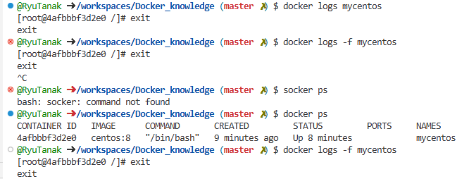

# Dockerの基本コマンド  

## その前に  

今回ローカル環境にDockerをインストール出来なかったため  
クラウド上のDockerを使用する。  

Udemyで紹介されたもの→[Docker Hub](https://www.docker.com/play-with-docker/)  
Docker Hubのアカウントを作成することで、利用することができる。  
だた、1日4時間しか使用できないと、使用制限付き  

GithubでDockerを利用する。  
Gituhbでログインしたら画面上のメニューから「Codespace」を選択する。  
右上の「New codespace」をクリック。  
レポジトリを選択するので、任意のレポジトリを選択し、「Create codespace」をクリック  
すると、ブラウザ上でVscodeが起動するので、Vscodeのターミナル画面でDockerを使用することができる。  

## docker run  

dockerコンテナを1つ起動するコマンド  
→docker imageがない場合、docker hubから自動で取得  

```
docker run イメージ名
```
今回は、docker run hello-worldを実行  
コンソールの中にHello From Docker!と出ればOK  

## docker ps  

起動中のコンテナを表示するコマンド  
-a オプションをつけると、停止中のコンテナも表示される  

先ほど起動したコンテナを見てみる。  
  
「docker ps」のみだと一覧にコンテナは表示されない  
　→コンテナはプロセスが動いていないと停止するという特性を持つ。  
   hello-worldコンテナはコンソールに「Hello From Docker」と表示するのみのコンテナのため  
   プロセスはすぐに止まる。  
-a をつけることで、表示される。  

### docker runのオプションコマンド  

先ほどのhello-worldコンテナの名前を変更する。  
```
docker run --name tanaka-udemy hello-world
```
psコマンドで名前を見ると、変更されていることが分かる。  
  

コンテナを起動した後に削除するコマンド  
```
docker run --name rmtest --rm hello-world
```
上記を実行することで、rmtestというコンテナが起動した後、削除される。　　

## docker start/stop/restart  

例　docker start コンテナ指定  
コンテナ指定には、コンテナID or コンテナ名を入れる。  

まずCentOSのコンテナを起動する。  
```
docker run -it --name mycentos centos:8 /bin/bash
```
詳しくは後程  
exitで抜ける。  
psコマンドで見るとコンテナが作られていることが分かる。  
  

コンテナを指定して、起動させる。  
```
docker start mycentos
```
これで起動していることが分かる。  
  

## docker exec

bashを使うことで、コマンドライン経由でコンテナに入ることができる。  

docker execは起動中のコンテナに入らずにコマンドを実行できる。  
-it オプションで中に入ることができる。  
```
docker exec コンテナ指定 コマンド
```

下画面は、centosのバージョンを確認するcatコマンドを  
コンテナの中と外から実行した結果である。  
  

## docker rm  

停止中のコンテナを削除するコマンド  
-fオプションで起動中でも強制削除できる。  
※コンテナ内のデータも消えるので注意  
```
docker rm コンテナ指定
```
  


## docker image  

ローカルにあるimageをすべて表示  

```
docker images
```
  


## docker rmi  

Dockerのイメージを削除  
- 現存するコンテナのイメージは削除できない  
- Dockerイメージは依存関係があるため、ベースイメージは削除できない   

```
docker rmi イメージ指定
```
  


## docker build  

Dockerfileからイメージを生成  
```
docker build Dockerfileパス
```
詳しくは後程  

## docker cp  

コンテナとホストマシンでファイルのやり取りを行うコピーコマンド  
ホスト→コンテナ  
```
docker cp ホストファイルのパス コンテナ指定:コンテナのパス
```
コンテナ→ホスト  
```
docker cp コンテナ指定:コンテナのパス ホストファイルのパス
```
  

コピーコマンドなのでコピー元のファイルは消えない。  
コンテナ→ホストにコピーするときのコマンドはホスト側で実行する。  

## docker logs  

Dockerコンテナのログを出力  
```
docker logs コンテナ指定
```
-fオプションでリアルタイムログ  
  

～～～～ここまでは必須コマンド～～～～  
～～～～ここからは必須ではないけどあれば便利コマンド～～～～  

## 