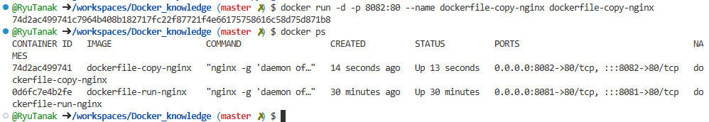
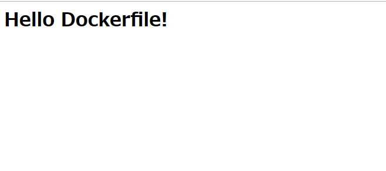
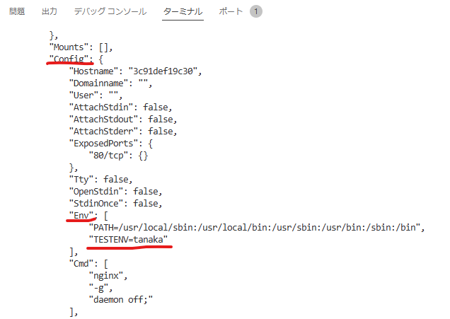

# dockerfileとは  

Dockerイメージをコード化したもの  
Docker buildコマンドを実行すると、テキストファイルからDockerイメージを作成  

簡単な例  
```
FROM nginx:1.16
RUN apt install -y
COPY source /var/www/html
EXPOSE 8080
```
詳しくは後程  

## Dockerfileのベストプラクティス  

https://docs.docker.jp/engine/articles/dockerfile_best-practice.html  

  
→エフェメラルは状態を持たないという意味  
 コンテナにボリュームを持たせないようにホストと共有させたこととか  


## Dockerfileの主要コマンド  

### RUNとCND  

どちらもLinuxコマンドを実行する命令  
実行タイミングが異なる。  

RUN:Dockerfile→イメージ  
CMD:イメージ→コンテナ  

```
RUN apt-get install -y nginx
CMD ["nginx","-g","daemon off;"]
```

以下のDockerfileを実行する。  
```
FROM ubuntu:20.04
RUN apt-get update -y && \
    apt-get install -y nginx
CMD ["nginx", "-g", "daemon off;"] 
```

```
FROM ubuntu:20.04
```
→ベースのOSがubuntuを指定。  

```
RUN apt-get update -y && \
```
→パッケージのアップデート  
 「&& \」はレイヤーを1つにまとめる  

```
    apt-get install -y nginx
```
→nginxのインストール  
ここまでがビルド時に実行されるもの  

```
CMD ["nginx", "-g", "daemon off;"] 
```
→nginxの起動コマンド  

buildコマンドを使ってイメージを作成する。  
```
docker build -t dockerfile-run-nginx /workspaces/Docker_knowledge/run/
```
-tオプションはイメージの名前をつけるもの  
最後にDockerfileがあるディレクトリを指定  

実行すると、イメージが作成される。  
  

このイメージからコンテナを作成してみる  
```
docker run -d -p 8081:80 --name dockerfile-run-nginx docker-run-nginx
```
コンテナが作成され、起動していることが分かる  
  


## COPYとADD  

どちらもファイルをイメージに追加するコマンド  
→ADDはネット経由でも追加できる  
```
COPY ホストのファイル コンテナのパス
```

使いどころ  
- イメージにプログラムのソースコードを入れたい場合  
- 設定ファイルをソフトの方に入れておいて、その設定ファイルが反映された状態でイメージを作りたいとき  

今回は前者の使いどころで試す。  

index.html  
```
<h1>Hello Dockerfile!</h1>
```
Dockerfile  
```
FROM ubuntu:20.04
RUN apt-get update -y && \
    apt-get install -y nginx
COPY index.html /var/www/html
CMD ["nginx", "-g", "deamon off;"]
```

以下のコマンドでイメージを作成  
```
docker build -t dockerfile-copy-nginx /workspaces/Docker_knowledge/copy/
```
  

イメージからコンテナを作成  
```
docker run -d -p 8082:80 --name dockerfile-copy-nginx dockerfile-copy-nginx
```
コンテナが作成された。  
  
  


## ENV  

環境変数を設定するコマンド  
```
ENV DB_USER tanaka
```

Dockerfileの作成  
```
FROM ubuntu:20.04
RUN apt-get update -y && \
    apt-get install -y nginx
ENV TESTENV="tanaka"
# ENV APP_ENV="production"  複数設定可能
CMD ["nginx", "-g", "daemon off;"] 
```

イメージ作成コマンド  
```
docker build -t dockerfile-env-nginx /workspaces/Docker_knowledge/env/
```

コンテナ作成コマンド  
```
docker run -d -p 8083:80 --name dockerfile-env-nginx dockerfile-env-nginx
```

環境変数の確認コマンド  
```
docker inspect dockerfile-env-nginx
```
コンテナの詳細を確認すると環境変数が設定されていることが分かる  
  


#　まとめ MariaDBを作ろう  

Docerfileの用意  
```
FROM mariadb:10.4
RUN apt-get update -y
COPY my.conf /etc/mysql/conf.d
COPY create-table.sql /docker-entrypoint-initdb.daemon
ENV MARIADB_USER=root
ENV MARIADB_DATABASE=docker
ENV MARIADB_ROOT_PASSWORD=root
```
「FROM mariadb:10.4」公式のデータベースイメージを指定することによって、cmdを書く必要がない？  
  →コマンドが用意されているため  
「create-table.sql」テーブルを作るためのSQL。コンテナになった時にこのCreate tableが掛かれているSQLが実行される  
「ENV MYQSL_DATABASE=docker」コンテナ作成時にdockerというデータベースが作られる  

以下のGitから各設定ファイルを取得  
https://github.com/uchidayuma/udemy-docker/tree/main/dockerfile/mariadb  

イメージの作成  
```
docker build -t mymariadb /workspaces/Docker_knowledge/mariadb
```

イメージからコンテナの作成  
```
docker run -d --name mymariadb mymariadb
```

ちゃんとできているか確認する。  
コンテナの中に入る  
```
docker exec -it mymariadb /bin/bash
```
これでログインとかしてみて確認する。  
