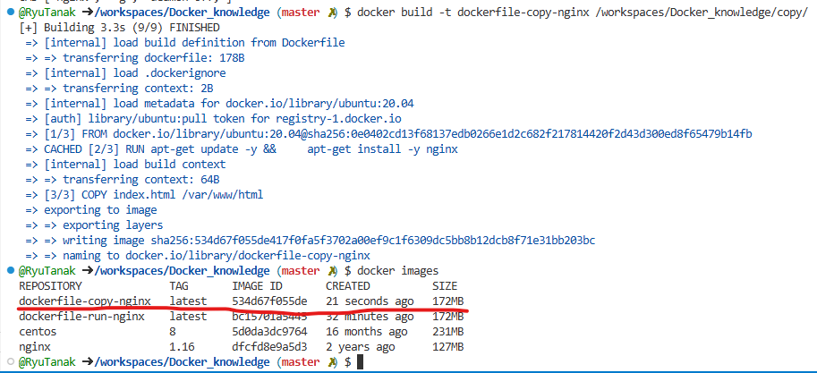

# dockerfileとは  

Dockerイメージをコード化したもの  
Docker buildコマンドを実行すると、テキストファイルからDockerイメージを作成  

簡単な例  
```
FROM nginx:1.16
RUN apt install -y
COPY source /var/www/html
EXPOSE 8080
```
詳しくは後程  

## Dockerfileのベストプラクティス  

https://docs.docker.jp/engine/articles/dockerfile_best-practice.html  

  
→エフェメラルは状態を持たないという意味  
 コンテナにボリュームを持たせないようにホストと共有させたこととか  


## Dockerfileの主要コマンド  

### RUNとCND  

どちらもLinuxコマンドを実行する命令  
実行タイミングが異なる。  

RUN:Dockerfile→イメージ  
CMD:イメージ→コンテナ  

```
RUN apt-get install -y nginx
CMD ["nginx","-g","daemon off;"]
```

以下のDockerfileを実行する。  
```
FROM ubuntu:20.04
RUN apt-get update -y && \
    apt-get install -y nginx
CMD ["nginx", "-g", "daemon off;"] 
```

```
FROM ubuntu:20.04
```
→ベースのOSがubuntuを指定。  

```
RUN apt-get update -y && \
```
→パッケージのアップデート  
 「&& \」はレイヤーを1つにまとめる  

```
    apt-get install -y nginx
```
→nginxのインストール  
ここまでがビルド時に実行されるもの  

```
CMD ["nginx", "-g", "daemon off;"] 
```
→nginxの起動コマンド  

buildコマンドを使ってイメージを作成する。  
```
docker build -t dockerfile-run-nginx /workspaces/Docker_knowledge/run/
```
-tオプションはイメージの名前をつけるもの  
最後にDockerfileがあるディレクトリを指定  

実行すると、イメージが作成される。  
  

このイメージからコンテナを作成してみる  
```
docker run -d -p 8081:80 --name dockerfile-run-nginx docker-run-nginx
```
コンテナが作成され、起動していることが分かる  
  


## COPYとADD  

どちらもファイルをイメージに追加するコマンド  
→ADDはネット経由でも追加できる  
```
COPY ホストのファイル コンテナのパス
```

使いどころ  
- イメージにプログラムのソースコードを入れたい場合  
- 設定ファイルをソフトの方に入れておいて、その設定ファイルが反映された状態でイメージを作りたいとき  

今回は前者の使いどころで試す。  

index.html  
```
<h1>Hello Dockerfile!</h1>
```
Dockerfile  
```
FROM ubuntu:20.04
RUN apt-get update -y && \
    apt-get install -y nginx
COPY index.html /var/www/html
CMD ["nginx", "-g", "deamon off;"]
```

以下のコマンドでイメージを作成  
```
docker build -t dockerfile-copy-nginx /workspaces/Docker_knowledge/copy/
```
  

イメージからコンテナを作成  
```
docker run -d -p 8082:80 --name dockerfile-copy-nginx dockerfile-copy-nginx
```
コンテナが作成された。  
  
  


## ENV  

環境変数を設定するコマンド  
```
ENV DB_USER tanaka
```

