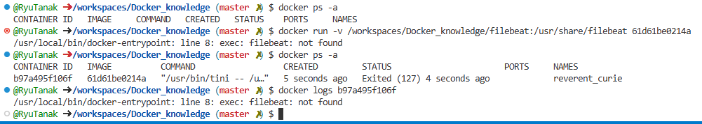

# FilebeatをDockerで自由に動かしてみる  

## ダウンロード方法  

インストール方法は2つ考えられる  
1. LinuxOSをインストールして、ymlコマンドとかを使ってインストールする方法  
2. イメージをダウンロードする  

一旦、2の方法で試してみる。  

Filebeatのリファレンスからイメージを取得する。  
- Filebeatの[リファレンス](https://www.elastic.co/guide/en/beats/filebeat/7.17/running-on-docker.html#running-on-docker)  

### ダウンロードしてみる  

Githubのcodespaceを利用する。  

イメージの取得  
```
docker pull docker.elastic.co/beats/filebeat:7.17.8
```
  

コンテナを起動してみる  
```
docker run imageID 
```
これだと起動はするが、Filebeatの中に入っていけないため、以下を実行  
```
docker run --name filebeat -it imageID /bin/bash
```
  
これでFilebeatの中に入れた。  

### OSを確認する  

Filebeatのイメージを使ったが、どのOSで動いているのかを確認する  
OS確認コマンド  
```
cat /etc/os-release
```
  
確認すると、ubuntuが使用されていた。  

### Filebeatの設定ファイル等を確認する  

カレントディレクトリは/usr/share/filebeatであり、中を見てみると  
  
このようにfilebeatの設定ファイル等が置かれていた  
ファイル配置の[リファレンス](https://www.elastic.co/guide/en/beats/filebeat/7.17/directory-layout.html#_docker)を見ると、dockerの場合は  
フォルダ構成が今までとは違うことが分かる  

catコマンドでfilebeat.ymlの中は以下のようになっている。  
```yaml
filebeat.config:
  modules:
    path: ${path.config}/modules.d/*.yml
    reload.enabled: false

processors:
  - add_cloud_metadata: ~
  - add_docker_metadata: ~

output.elasticsearch:
  hosts: '${ELASTICSEARCH_HOSTS:elasticsearch:9200}'
  username: '${ELASTICSEARCH_USERNAME:}'
  password: '${ELASTICSEARCH_PASSWORD:}'
```
予測だが、上記の「ELASTICSEARCH_HOSTS」などの大文字の変数は環境変数なのかなと思われる。  
コンテナ起動時にこれらの環境変数を指定することで、接続先のElasticsearchを指定することができそう。  


### filebeat.ymlをvolumeしてみる  

ローカルのfilebeatフォルダと、コンテナの/usr/share/filebeatファイルを共有する。  

→マウントできない  
  
※結論として、/usr/share/filebeatフォルダはマウントできない。  
  実行体ファイルがあるフォルダをホストのフォルダマウントすると、実行体がない状態になり、結果としてFilebeatが起動しなくなるため。  

filebeat.ymlはCOPYで送ることとする。  

### Dockerfileで動かしてみる  

以下のようにDockerfileを実装する。  
```
FROM docker.elastic.co/beats/filebeat:8.6.0
COPY filebeat.yml /usr/share/filebeat/filebeat.yml
```

イメージ作成  
```
docker build -t 61d61be0214a /workspaces/Docker_knowledge/filebeat/
```
コンテナ作成  
```
docker run -d -v /workspaces/Docker_knowledge/filebeat/data:/usr/share/filebeat/data --name filebeat -it 922e3d4f15a0 /bin/bash
```

ここまでやったけど、、、結局Filebeatは思うように動かない。  
(systemctlコマンドもないと言われ、起動しているのかどうかも確認できない...)  


↓↓↓  
実行コマンドを修正  
Dockerfile  
```
FROM docker.elastic.co/beats/filebeat:7.17.8              # イメージ指定
COPY filebeat.yml /usr/share/filebeat/filebeat.yml        # ホストのfilebeat.ymlをコンテナに上書き
USER root                                                 # コマンド実行の前にroot権限に変更
RUN chown root:filebeat /usr/share/filebeat/filebeat.yml  # 所有者をrootに、所有グループをfilebeatに変更
RUN chmod go-w /usr/share/filebeat/filebeat.yml           # 「自分以外の人」が「書き込めない」ように設定（http://www.damp.tottori-u.ac.jp/~ooshida/unix/chmod.html）
USER filebeat                                             # filebeat権限に戻る
```

イメージ作成  
```
docker build it filebeat_image ./filebeat
```
コンテナ作成  
```
docker run -d -v /workspaces/Docker_knowledge/filebeat/data:/usr/share/filebeat/data --name filebeat_container filebeat_image
```

一応これで動いているみたい  

