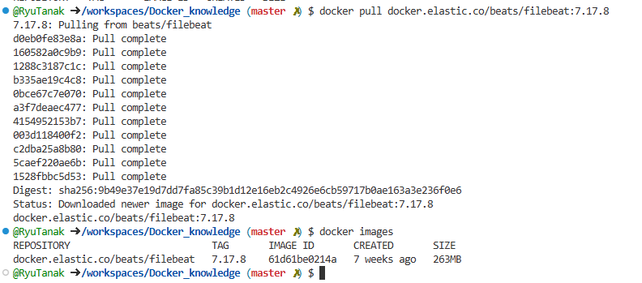
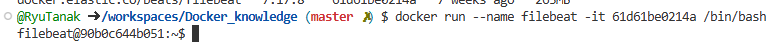
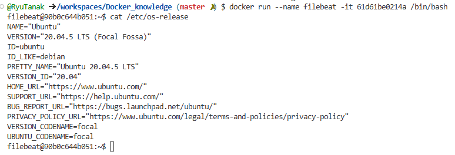
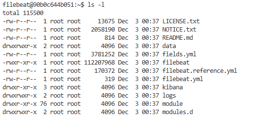

# FilebeatをDockerで自由に動かしてみる  

## ダウンロード方法  

インストール方法は2つ考えられる  
1. LinuxOSをインストールして、ymlコマンドとかを使ってインストールする方法  
2. イメージをダウンロードする  

一旦、2の方法で試してみる。  

Filebeatのリファレンスからイメージを取得する。  
- Filebeatの[リファレンス](https://www.elastic.co/guide/en/beats/filebeat/7.17/running-on-docker.html#running-on-docker)  

### ダウンロードしてみる  

Githubのcodespaceを利用する。  

イメージの取得  
```
docker pull docker.elastic.co/beats/filebeat:7.17.8
```
  

コンテナを起動してみる  
```
docker run --name filebeat -it imageID /bin/bash
```
これだと起動はするが、Filebeatの中に入っていけないため、以下を実行  
```
docker run --name filebeat -it imageID /bin/bash
```
  
これでFilebeatの中に入れた。  

### OSを確認する  

Filebeatのイメージを使ったが、どのOSで動いているのかを確認する  
OS確認コマンド  
```
cat /etc/os-release
```
  
確認すると、ubuntuが使用されていた。  

### Filebeatの設定ファイル等を確認する  

カレントディレクトリは/usr/share/filebeatであり、中を見てみると  
  
このようにfilebeatの設定ファイル等が置かれていた  
ファイル配置の[リファレンス](https://www.elastic.co/guide/en/beats/filebeat/7.17/directory-layout.html#_docker)を見ると、dockerの場合は  
フォルダ構成が今までとは違うことが分かる  

catコマンドでfilebeat.ymlの中は以下のようになっている。  
```yaml
filebeat.config:
  modules:
    path: ${path.config}/modules.d/*.yml
    reload.enabled: false

processors:
  - add_cloud_metadata: ~
  - add_docker_metadata: ~

output.elasticsearch:
  hosts: '${ELASTICSEARCH_HOSTS:elasticsearch:9200}'
  username: '${ELASTICSEARCH_USERNAME:}'
  password: '${ELASTICSEARCH_PASSWORD:}'
```
予測だが、上記の「ELASTICSEARCH_HOSTS」などの大文字の変数は環境変数なのかなと思われる。  
コンテナ起動時にこれらの環境変数を指定することで、接続先のElasticsearchを指定することができそう。  


