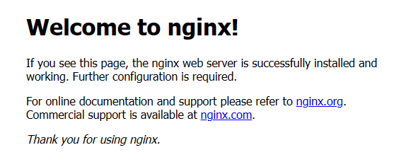
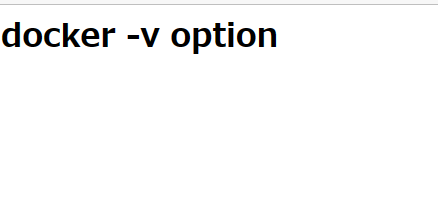

# Dockerコンテナのストレージ  

Dockerはパソコンのメモリ上に存在するもの  
→コンテナが削除されてしまうと、データも一緒に削除される。  

これをホストとのディレクトリ共有で解決する。  


## dockerで作るDBデータの永続化例  

```
docker run -v ホストのパス:コンテナのパス イメージ名
```

ここからの流れ  
1. Webサーバ（nginx）を立ち上げる  
   →docker run  
2. ボリュームの共有  
   →ホストのHTMLをコンテナへ  
3. オリジナルHTMLを表示  
   →ホストの編集をコンテナへ反映  

### nginxの立ち上げ  

以下のコマンドを実行  
```
docker run --name mynginx -p 8080:80 nginx:1.16
```
-p 8080:80  
  →ポートフォワーディングオプション  
ホストからWebサーバへアクセスするときは8080ポートを使用し、中から出てくるときは80ポートを使用するという設定  

nginxが起動し、ブラウザでアクセスすると以下の画面が出てくる。  
  

このnginxにオリジナルのHTMLを差し込んでみる  

```html:index.html
<h1>docker -v option</h1>
```

※パスの指定はフォルダを指定するように  
```
docker run -v /workspaces/Docker_knowledge/User/test/:/usr/share/nginx/html --name mynginx -p 8080:80 nginx:1.16
```
先ほど記述したHTMLが表示された。  
  


